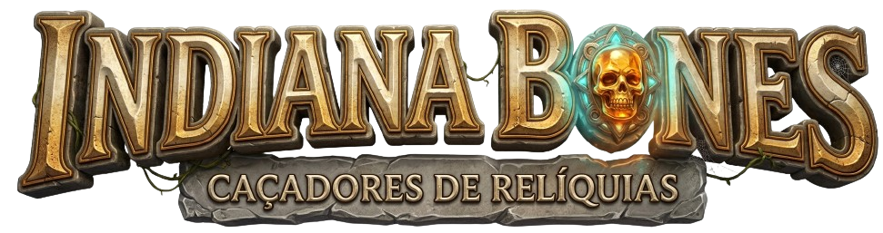

<div align="center">



# Indiana Bones

**Jogo de corrida para dois jogadores no navegador**


</div>

---

## 1. Identificação do Projeto

| | |
|---|---|
| **Título** | Indiana Bones |
| **Desenvolvedor** | Enzo Hipólito |
| **GitHub** | [@EnzoHipolito](https://github.com/EnzoHipolito) |
| **Email** | enzohipolito7@gmail.com |
| **Product Owner** | Carlos Roberto da Silva Filho |

---

## 2. Visão Geral do Sistema

### Descrição

Indiana Bones é um jogo 2D de corrida e desvio desenvolvido inteiramente com HTML5 Canvas e JavaScript puro, sem dependências externas. Dois jogadores competem simultaneamente na mesma tela, desviando de obstáculos e coletando artefatos para acumular pontos.

### Objetivo

Sobreviver o maior tempo possível desviando das pedras que vêm em direção aos personagens, enquanto coleta artefatos para aumentar a pontuação e corações para recuperar vidas. O jogador que acumular mais pontos ao final vence.

### Tema

Inspirado no universo de aventura de Indiana Jones, os jogadores controlam exploradores que precisam escapar de rochas e coletar relíquias arqueológicas em uma corrida frenética. O jogo possui 3 fases com dificuldade progressiva.

---

## 3. Instruções de Jogabilidade

### Controles

| Ação | Player 1 | Player 2 |
|---|---|---|
| Mover para cima | `W` | `↑` |
| Mover para baixo | `S` | `↓` |
| Reiniciar (Game Over) | `Enter` | `Enter` |

### Coletáveis

| Item | Efeito |
|---|---|
| 🏺 **Artefato** | +5 pontos |
| ❤️ **Coração** | +1 vida |
| 🪨 **Pedra** | -1 vida (obstáculo) |

---

## 4. Especificações Técnicas

### Progressão de Fases

| Fase | Condição | Velocidade dos Obstáculos |
|---|---|---|
| **Fase 1** | Início do jogo | 3 |
| **Fase 2** | Qualquer jogador com > 30 pontos | 3 – 6 (aleatório) |
| **Fase 3** | Qualquer jogador com > 60 pontos | 7 – 10 (aleatório) |

### Sistema de Vidas

- Cada jogador começa com **5 vidas**
- Colisão com pedra: **-1 vida**
- Coletar coração: **+1 vida**
- Jogador sem vidas é removido da tela
- **Game Over** quando ambos os jogadores chegam a 0 vidas

### Pontuação

- Pedra que passa pela tela sem colidir: **+1 ponto**
- Coletar artefato: **+5 pontos**
- A pontuação de cada jogador é independente

### Engine

- Renderização via **HTML5 Canvas API** a 60fps com `requestAnimationFrame`
- Detecção de colisão por **AABB** (Axis-Aligned Bounding Box)
- Animação dos personagens por **spritesheet** (3 frames)
- Reposicionamento aleatório dos obstáculos ao saírem da tela

---

## 5. Instalação e Execução

### 1. Clonar o repositório

```bash
git clone https://github.com/EnzoHipolito/game-indiana.git
cd game-indiana
```

### 2. Executar o projeto

**Opção A — Live Server (VS Code)**
Instale a extensão "Live Server" em seu Visual Studio Code, e clique com o botão direito em `index.html` e selecione *Open with Live Server*.

**Opção C — Abrir direto** *(pode ter limitações de CORS com imagens)*
Entre na pasta "game-indiana" no seu explorador de arquivos, e clique em `index.html`.


## 6. Link de Produção

🔗 **[game-indiana.vercel.app](https://game-indiana.vercel.app)**

## 7. Estrutura do Projeto

```
game-indiana/
├── index.html          # Página inicial (menu)
├── game.html           # Tela do jogo
├── controles.html      # Página de controles
├── dev.html            # Página do desenvolvedor
├── index.js            # Lógica principal do jogo
├── models/
│   └── Carro.js        # Classes: Obj, Carro, CarroInimigo, Artefato, Text
├── img/
│   ├── logo.png
│   ├── image_bg.png
│   ├── indiana_001_bg.png
│   ├── indiana_002_bg.png
│   ├── indiana_003_bg.png
│   ├── rock_image.png
│   ├── artefact_image.png
│   └── heart.png
└── style/
    ├── style.css
    ├── game.css
    ├── controles.css
    └── dev.css
```

---

<div align="center">

Desenvolvido por **Enzo Hipólito** · Product Owner: **Carlos Roberto da Silva Filho**

</div>
